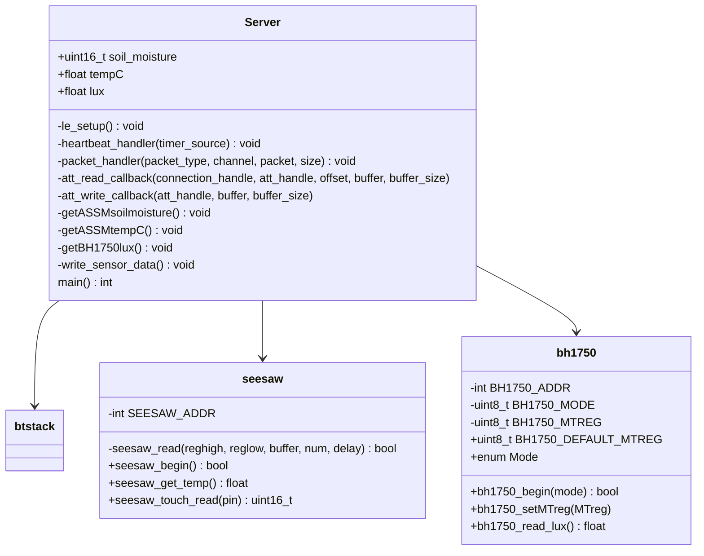

# Class Diagrams

## Hub Class Diagram

This sequence diagram describes the code package that will be run on the Garden Sensor Array's hub device. Here we have the Broker class that acts as the main class for the hub, 
and it is responsible for controlling the flow of data from the sensors to the database as well as for connecting the hub device to WiFi. It connects to WiFi by having users
enter WiFi credentials while the device is plugged into a computer. These credentials are then written to the Raspberry Pi's config file to allow it to connect to the internet
wirelessly. Broker also has the search_devices() function that scans nearby Bluetooth devices, determines which are unused Garden Sensors, and returns a list of them. The Sensors
are represented by the Sensor class, which stores their id and name. The Sensor class' connect() method then uses that id to connect to its respective sensor. The listen() method will
then be used to recieve data from that sensor and return it as an array of integers representing temperature, moisture, and sunlight. Another class we have is Database, which stores 
credentials that will be used by the Database class' connect() to connect the device to a given user's database table where their plant's data will be written using write_data(). 

## Sensor Array Class Diagram

This Diagram outlines the basic architecture of the program ran by the Sensor Contrul Units. Server is the main entry point for the program, and it is primarily responsible for reading the connected sensors and sending the data to a client. Server has relationships to several important libraries: seesaw (for interacting with the soil moisture and temperature sensor), bh1750 (for interacting with the the ambient light sensor), and btstack (the library for implementing Bluetooth Low Energy Functionality). Notably, the btstack library provides the funtionality implemented by the functions le_setup (configures advertisements and enables BLE), heartbeat_handler (called on a set interval to check the status of the BLE server), packet_handler (receives Bluetooth packets and decides what actions to take), and att_read/write_callback (triggered when a client issues a read or write request to the BLE server). Importantly, Server has association relationships with the libraries seesaw and bh1750 because it does not actually contain objects of type seesaw or bh1750, as the functions provided by the libraries allow direct access to reading the sensors without the explicit use of a datatype to represent them. Similarly, Server does not directly contain any objects of type btstack, but it will access functions from that library to initiate the BLE connection and handle BLE events.

## Web API Class Diagram

Pictured above is the UML Class Diagram for the frontend portion of the website. These are all the components that the user will directly view and interact with. The diagram is component focused as the website itself is written using React.js - which is component based. The first component at the very top is "App.js". This file is what holds all the components of the entire website, it is necessary in all react applications. This is the reason why the components underneath all eventually flow towards App.js - as it all the components are stated there. The Landingpage function is triggered which leads to the landing component - this acts as a gateway for the user to register or login into their account. Once the user is officially logged in or registered they will be directed to the fundamental part of the website. Each page on the website at this point will have three sections, a navigation bar at the top, a footer at the bottom, and the main aspect right in the center (the main aspect is the main topic shown on screen). The main component has four direct sub components. These components include: Home Page, My Sensors Page, Account Page, and Help/Setup. Each of these components have elements that create their "pages". The Home Page will have a top portion and a bottom portion. The top will display the current weather of the location that the user has set in their account page. It will only show the weather happening in real time- as reported by weather outlets, it will not forecast the hours or days after it. The bottom portion will have revolving tips that show general gardening tips. The next component titled My Sensors Page will cover the most important feature of the website. This page will showcase at least one card. Each sensor linked on the account will have their own card. The card will have the sensor id, the garden name, and it will also be clickable. When clicked it brings the user to that specific sensor's page. The specific sensor page shows the last updated statistics that were recorded, as well as button to activate the sensor and get real time statistics. A helpful figure will be on the bottom portion of this page. It gives a visual diagram of how to understand what the readings from the sensors mean and how they would apply in real life for the user. Sharing the bottom portion will be a "Show History" button that triggers the data-table. The data-table will have all the recorded info from this specific sensor. It's easy to read and easy to navigate, as usability is an essential factor of the website. Another page the user can access is the Account Page. This shows all the information entered during registration, and it also has a sub component that allows for the user to add or delete sensors linked to their account. The last main component page is the Help/Setup page, this does not have any actions or functions, just an explanation of everything the user might need to know to ensure they have a good experience using the Garden Sensor Array. The navigation bar and the footer stay the same no matter what, but the main component is what will change. The attribute: "page_id: int" is what lets the system know which "page" is which..The navigation bar will have tabs that allows the user to switch from one main aspect to another. The footer will be placed at the very bottom of the page and will have the product logo that is clickable, and leads back to the home page. When viewing this class diagram the relationships between the components are visible, and they all use aggregation. This is because without the parent the child is non- existent. For example, you can only get to a specific sensor's data table by accessing the "My Sensors Page" first, otherwise it is inaccessible/ unattainable.  