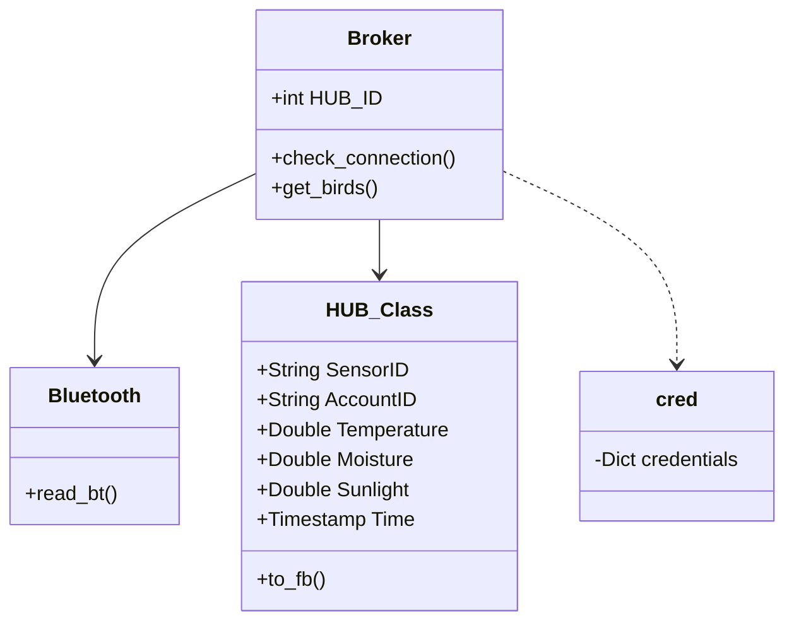
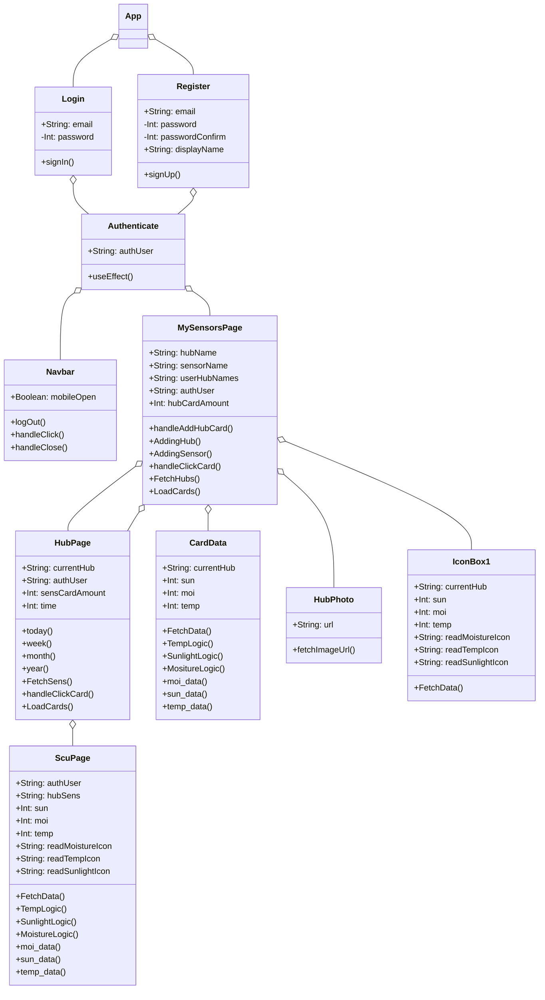

# Class Diagrams

## Hub Class Diagram

This sequence diagram describes the code package that will be run on the Garden Sensor Array's hub device. Here we have the Broker class that acts as the main class for the hub, 
and it is responsible for controlling the flow of data from the sensors to the database as well as for connecting the hub device to WiFi. It connects to WiFi by having users
enter WiFi credentials while the device is plugged into a computer. These credentials are then written to the Raspberry Pi's config file to allow it to connect to the internet
wirelessly. Broker also has the search_devices() function that scans nearby Bluetooth devices, determines which are unused Garden Sensors, and returns a list of them. The Sensors
are represented by the Sensor class, which stores their id and name. The Sensor class' connect() method then uses that id to connect to its respective sensor. The listen() method will
then be used to recieve data from that sensor and return it as an array of integers representing temperature, moisture, and sunlight. Another class we have is Database, which stores 
credentials that will be used by the Database class' connect() to connect the device to a given user's database table where their plant's data will be written using write_data(). 

## Sensor Array Class Diagram

This Diagram outlines the basic architecture of the sensor units. SensorMain is the program ran by the sensor units, and it has relationships to several important classes: Adafruit_Seesaw (the soil moisture and temperature sensor), BH1750 (the ambient light sensor), BluetoothBLE (the library for finding and connecting to other Bluetooth BLE devices), and BLECharacteristic (the library for managing BLECharacteristics and how they change). Importantly, SensorMain contains objects of type Adafruit_Seesaw, for representing the soil sensor; BH1750, for representing the light sensor; and BLECharacteristic, which will track the data recorded by the sensors and send data to the hub when there is new information to report. SensorMain does not directly contain any objects of type BluetoothBLE, but it will access functions from that library to initiate the BLE connection.

## Web API Class Diagram

Pictured above is the UML Class Diagram for the frontend portion of the website. These are all the components that the user will directly view and interact with. The diagram is component focused as the website itself is written using React.js - which is component based. The first component at the very top is "App.js". This file is what holds all the components of the entire website, it is necessary in all react applications. This is the reason why the components underneath all eventually flow towards App.js - as it all the components are stated there. Once the user is officially logged in or registered they will be directed to the fundamental part of the website. It then leads to Authenticate, which gives the rest of the components the correct user to fetch and write data to. The next component titled My Hubs Page (refered to as My SensorsPage in the code) will cover the most important feature of the website. This page will showcase at the users's hub cards - each of which use the components: CardData, HubPhoto, and IconBox1. Each hub linked to thier account will have their own card. When any hubcard is clicked it brings the user to that specific HubPage. The HubPage acts as a portal and displays all the sensors registered to that hub, all of their sensor cards being clickable as well. The specific sensor page shows the last updated statistics that were recorded. A section with 3 dynamic icons that represent the status of the sensors moisture, temperature, and sunlight levels will be present at the top right. It gives a visual representation of the data progression as well by showcasing 3 line graphs - one for each category. The navigation bar and the footer stay the same no matter what, but the main component is what will change. When viewing this class diagram the relationships between the components are visible, and they all use aggregation. This is because without the parent the child is non- existent. For example, you can only get to a specific sensor's data table by accessing the "My Sensors Page" first, otherwise it is inaccessible/ unattainable.

