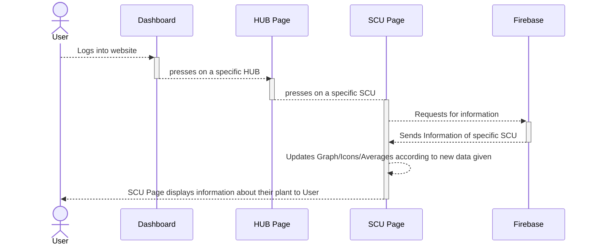
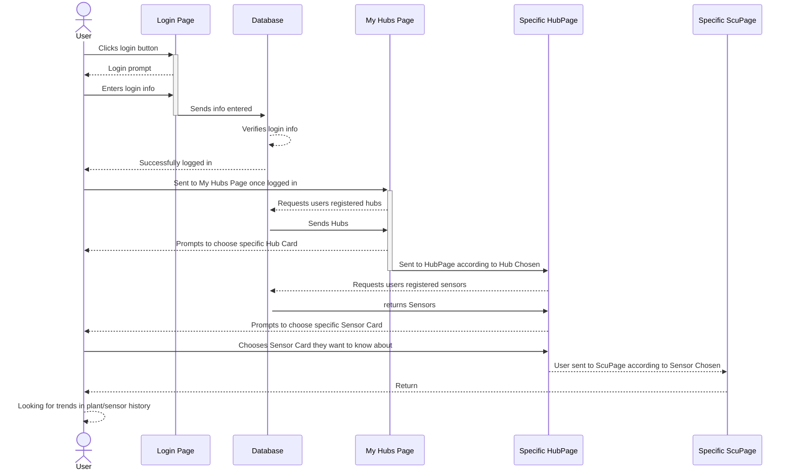
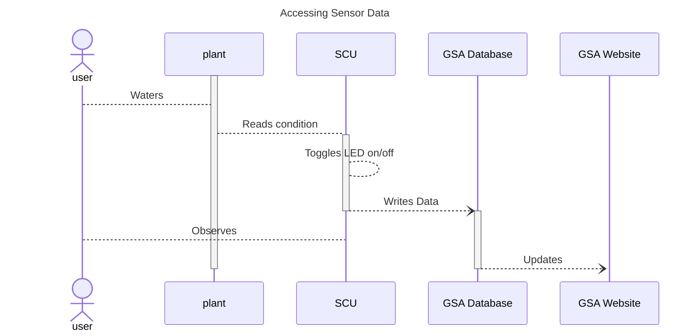
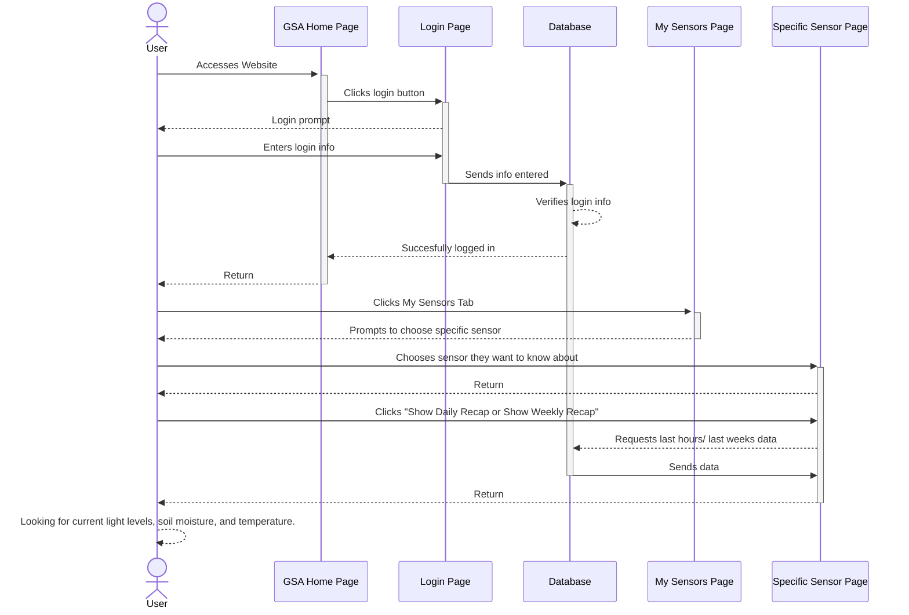
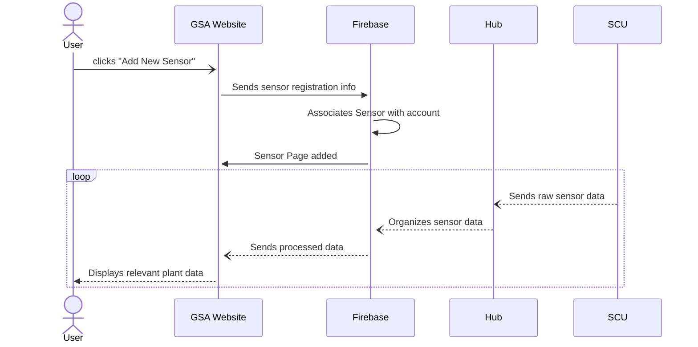

# Use Case Diagrams

## Use Case #1: Browsing Plant Data

In an event where the user wants to know more about the condition and health of their plant, they can do so by using Garden Sensor Array's dedicated website. Upon logging in successfully, the website will then gather all HUBS that are associated with the user and have them visible to the user as a list form. All HUBS listed are clickable items and once they are clicked, the user is taken to the specialized HUB page for that specific HUB they have chosen. The HUB Page will then gather all SCU's associated with the HUB and have them shown as list form, akin to the main dashboard. Upon clicking a specific SCU, the user will be taken to the specialized SCU page for that specific SCU they have chosen. The SCU page will then request information about the specific SCU from Firebase, which stores all the information gathered from our sensors. Firebase will then send all the required information to the SCU page and the SCU page responds by updating graphs, averages, and icons according to the new data it has received. After all updates are finalized and fixed visibly within the SCU page, the user is able to see all the information they need about their plant.

## Use Case #2: Monitoring Long Term Plant Growth

Not only does the Garden Sensor Array allow for users to get real-time information about thier plant, but it also allows for users to check previously recorded data as well. This becomes useful in events where the user wants to find trends or patterns in their plant's history, epspecially if the plant in question is growing much slower than expected. The User can go to the GSA website and login. Once the credentials that were entered in by the user are verifed with the database, the user will be succesfully logged in. Now, they can select the "My Sensors Tab" located at the top of the page. At this point the user will be presented with all the sensor units they have connected and can pick the one they specifically want to know more about. When the specifc sensor is chosen, the user will be redirected to that specific sensor's page. Here, the user will have the option to view all the sensor's recorded data by clicking "Show History". This button requests all the appropriate data from the database; and once returned, the page will be able to show the full recorded history that the sensor took of the plant. The user will be able to check for any trends to solve the growth problem.

## Use Case #3: Accessing Sensor Data in Person

It isn't always convinient for a user to access their devices while in their garden so, for convenience, the sensor cluster unit is equipped with a LED that changes state based on measured data. When sensor data is read, the unit will decide whether or not to update the LED, and the user need only to look upon its visage to determine whether sufficient gardening has been done. 

## Use Case #4,5,6 : Monitoring Soil Moisture, Light Levels, Temperature

The gardener seeks for their daily or weekly data on their sensors page. The database mantains three averages. The weekly, daily, or hourly average of their sensor's readings of light levels, soil moisture, or temperature. Once the gardener reaches the site's page on their sensors, the home page of that sensor will display one of the requested averages from the user in a drop down menu underneath that sensors readings. On default the home page of the sensor will display the daily monitoring. If the user wishes to be able to see the levels locally at the sensor, the sensor will display on their metric otherwise a green or red LED on the sensors status. The threshold of whether its red or green can be set by the user under sensor settings page. 

## Use Case #7: Adding Additional Sensor Clusters

When users want to monitor a new plant or garden, they can do so by pairing a new sensor control unit to o their account. First, they type the sensor's serial number and desired name they want to give the sensor (any plant name or identifier). That information goes to Firebase where that sensor is associated with that user's account, at which point a page will be created on the website and sensor data will begin populating it and will update continuously in real time. This sensor data is transmitted from sensors via a Hub device that the user paired beforehand. 
