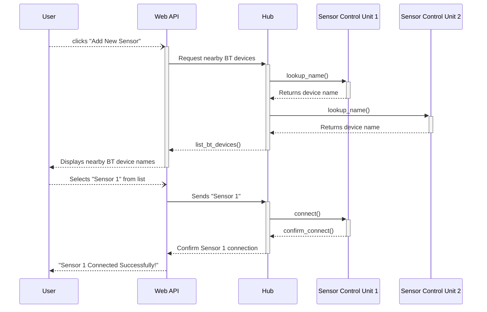

When users want to monitor a new plant or garden, they can do so by pairing a new sensor control unit to one of their hubs.
To start, they can select "add new sensors" on the web app that will send a request to the hub to begin sending requests to 
all nearby Bluetooth devices to ask for their names. After recieving a list of all nearby devices, the hub will return that 
list to the web app that will then prompt the user to select the sensor contol unit they wish to add. The web app then returns
the users selection to the hub that will then initiate a connection with the respective sensor control unit. Upon successful 
connection, the hub returns that the connection was sucessful and the web app will display "Sensor 1 Connected Successfully!"
