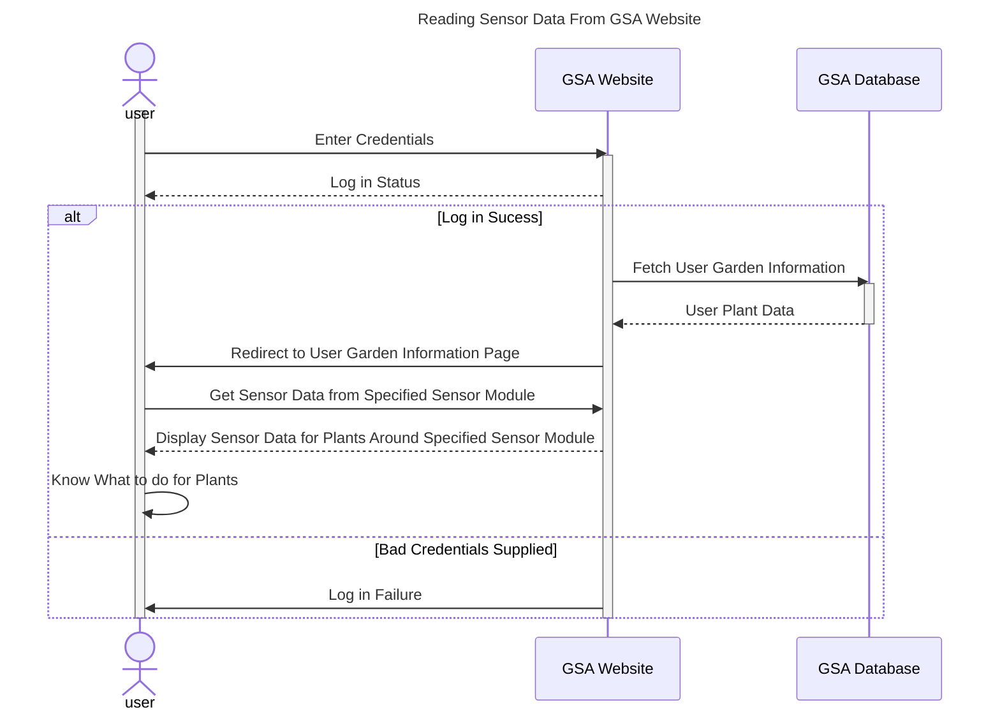

# Use Case Diagrams

## Use Case #1: Browsing Plant Data

In an event where the user wants to browse through their Plant data, they can do so by using Garden Sensor Array's dedicated website. In the GSA Website, the user will be given the option to press the "Plant Data" button. By selecting this button, the GSA Website will then request for the current Plant information stored within the Plant Databse. The Plant Database, upon receiving the request, will send out the current Plant information collected from the sensors to the GSA Website. The website will then take this information and update the Plant Data Dropdown list with its corresponding data field. Once the update has been completed, the newly updated Plant Data Dropdown list will be shown to the user for viewing within the GSA Website.

## Use Case #4: Monitoring Garden Conditions

If the user is unable to physically access their garden (maybe they are at work of on vacation) they will want to check the conditions in their garden so they can know what they need to do when they get home or what to tell the person caring for their garden. First, the user will log into the GSA website with their user credentials. If the log in succeeds, the website will fetch the relevant data from a database so that it is ready to be displayed for the user, then redirect them to the page where they can access their garden information. If the log in fails, the user will simply be met with a log in failure message. Assuming the log in succeeded, The user will select the sensor module(s) that they want to read data from and it will be displayed on the webpage. From this, the user will know the conditions of the plants located around each sensor module and can figure out what steps they would like to take to care for their garden.

## Use Case #7: Adding Additional Sensor Clusters

When users want to monitor a new plant or garden, they can do so by pairing a new sensor control unit to one of their hubs.
To start, they can select "add new sensors" on the web app that will send a request to the hub to begin sending requests to 
all nearby Bluetooth devices to ask for their names. After recieving a list of all nearby devices, the hub will return that 
list to the web app that will then prompt the user to select the sensor contol unit they wish to add. The web app then returns
the users selection to the hub that will then initiate a connection with the respective sensor control unit. Upon successful 
connection, the hub returns that the connection was sucessful and the web app will display "Sensor 1 Connected Successfully!"

## Use Case #8: Resetting Password

If the user finds themselves in a position where they need to reset their password, they are able to do so by navigating to the login page, and selecting the "Trouble Loggin In?" button. This will redirect them to an account recovery page, which prompts them to enter their recovery credentials (Email and secret questioon). After the user enters their credentials, they will be checked against the information stored in the user database. Upon confirmation, the user will be redirected to a page which prompts for an updated password. Once the new password is entered, it is updated in the user database, and the user is again redirected to the login page. Here, the user is able to enter their newly reestablished credentials, and log in, taking them to the account page.
